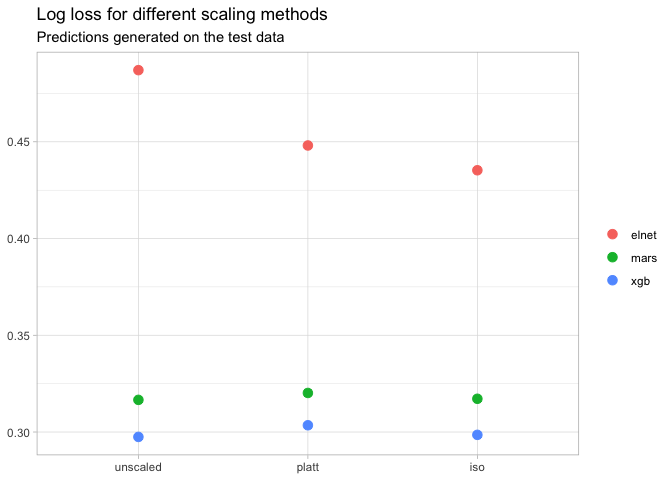
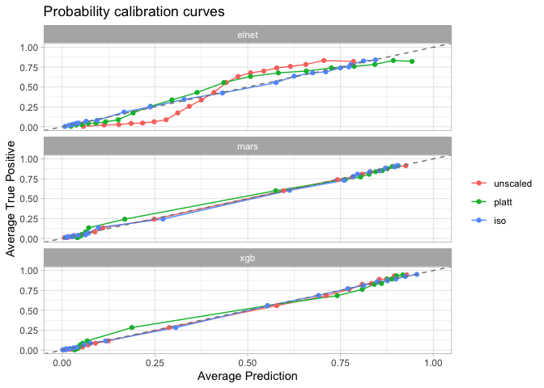

Testing `{targets}`
================

This is an example of predictive modelling using the [`{targets}`
package](https://wlandau.github.io/targets/), Will Landau’s new package
that sort-of replaces [`{drake}`](https://docs.ropensci.org/drake/). I
did [something similar with `{drake}` and
`{tidymodels}`](https://github.com/hamedbh/test-drake-tidymodels) a
while ago, this time with a different dataset and a slightly different
selection of models.

The two main aims here are:

1.  Explore how `{targets}` works, check how it’s different.
2.  Try out probability calibration for the outputs of predictive
    models, and see how it affects the quality of the probability
    predictions.

The problem is binary classification using the `diamonds` dataset from
`{ggplot2}`: the `cut` variable is changed to be `ideal` or `other`, and
that is the binary outcome to be predicted.

We can check the balance of the classes in the training data.

    tar_read(gem_split) %>% 
        training() %>% 
        count(cut) %>% 
        mutate(pct = n/sum(n)) %>% 
        ggplot(aes(cut, pct)) + 
        geom_col() + 
        scale_y_continuous(labels = percent) + 
        labs(
            title = "Proportion of classes for cut", 
            x = NULL, 
            y = NULL
        ) + 
        theme(legend.position = "none")

<!-- -->

A 60/40 split is ok for modelling purposes, but that imbalance might
affect the quality of the probability estimates. We can test this with
the probability calibration later on.

For this report we skip the EDA steps and discussion of the model
tuning. All of that can be found in the `_targets.R` file in this repo.

Let’s compare performance for the three model types: Elastic Net
Logistic Regression; Multivariate Adaptive Regression Splines;
Gradient-boosted Decision Trees (XGBoost).

    unscaled_preds <- tar_read(unscaled_preds) %>% 
        set_names(
            c("elnet", 
              "mars", 
              "xgb"
            )
        )
    imap_dfr(unscaled_preds, 
             ~ bind_rows(
                 roc_auc(.x, truth = cut, .pred_ideal), 
                 pr_auc(.x, truth = cut, .pred_ideal), 
                 gain_capture(.x, truth = cut, .pred_ideal)
             ) %>% 
                 add_column(
                     model = .y, 
                     .before = 1L
                 ) %>% 
                 select(-.estimator)
    ) %>% 
        mutate(
            across(
                c(model, .metric), 
                factor
            )
        ) %>% 
        ggplot(aes(model, .estimate, colour = rev(.metric))) + 
        geom_point() + 
        labs(
            title = "Model performance", 
            subtitle = "Scores for simplest models within 1% of best overall", 
            x = NULL, 
            y = NULL, 
            colour = NULL
        )

<!-- -->

The ranking of the models is the same by any of these metrics, and that
isn’t too surprising. We can also check how well the probabilities are
calibrated in a couple of ways. Firstly by just calculating the [log
loss](https://en.wikipedia.org/wiki/Cross_entropy#Cross-entropy_loss_function_and_logistic_regression)
or categorical cross-entropy for each model, and then plotting the
curves and doing an eyeball test.

    imap_dfr(unscaled_preds, 
             ~ mn_log_loss(.x, truth = cut, .pred_ideal) %>% 
                 add_column(
                     model = .y, 
                     .before = 1L
                 ) %>% 
                 select(-.estimator) %>% 
                 mutate(across(.estimate, 
                               ~ round(.x, 3))
                 )
    )
    ## # A tibble: 3 x 3
    ##   model .metric     .estimate
    ##   <chr> <chr>           <dbl>
    ## 1 elnet mn_log_loss     0.487
    ## 2 mars  mn_log_loss     0.317
    ## 3 xgb   mn_log_loss     0.297

    imap_dfr(unscaled_preds, 
             ~ .x %>% 
                 select(.pred_ideal, cut) %>% 
                 add_column(model = .y, 
                            .before = 1L) %>% 
                 mutate(prob_bucket = ntile(.pred_ideal, 20)) %>% 
                 group_by(model, prob_bucket) %>% 
                 summarise(
                     avg_pred = mean(.pred_ideal), 
                     avg_truth = mean(cut == "ideal"), 
                     .groups = "drop"
                 ) %>% 
                 ungroup()
             ) %>% 
        mutate(model = factor(model)) %>% 
        ggplot(aes(avg_pred, avg_truth, colour = model)) + 
        geom_line() + 
        geom_point() + 
        geom_abline(slope = 1, 
                    intercept = 0, 
                    linetype = 2, 
                    colour = "grey50") + 
        coord_cartesian(xlim = c(0, 1), 
                        ylim = c(0, 1)) + 
        labs(
            title = "Probability calibration curves", 
            x = "Average Prediction", 
            y = "Average True Positive", 
            colour = NULL
        )

<!-- -->

The MARS and XGBoost models track the ideal line rather well, while the
Elastic Net model shows the sigmoid shape.

Now we can try scaling the probabilities generated on the test data
using [Platt scaling](https://en.wikipedia.org/wiki/Platt_scaling) and
[Isotonic
regression](https://en.wikipedia.org/wiki/Isotonic_regression). The
`calibrate_fit_platt()` and `calibrate_fit_iso()` functions do this from
any table of predictions. The resulting object from those functions has
a predict object that can be used on new data. See the script in this
repo for more info.

    pred_list <- c(
        unscaled_preds %>% 
            set_names(str_c("unscaled_", names(.))), 
        tar_read(platt_scaled_preds) %>% 
            set_names(str_c("platt_", c("elnet", "mars", "xgb"))), 
        tar_read(iso_scaled_preds) %>% 
            set_names(str_c("iso_", c("elnet", "mars", "xgb")))
    )

    pred_res <- pred_list %>% 
        imap_dfr(
            ~ tibble(
                grp = .y, 
                log_loss = mn_log_loss(
                    .x, 
                    truth = cut, 
                    .pred_ideal
                ) %>% 
                    pull(.estimate), 
                roc_auc = roc_auc(
                    .x, 
                    truth = cut, 
                    .pred_ideal
                ) %>% 
                    pull(.estimate)
            )
        ) %>%
        separate(
            col = grp, 
            into = c("scaling", "model"), 
            sep = "_"
        ) %>% 
        mutate(
            model = factor(model), 
            scaling = factor(scaling, 
                             levels = c("unscaled", "platt", "iso"))
        )

    pred_res %>% 
        ggplot(aes(scaling, log_loss, colour = model)) + 
        geom_point(size = 3) + 
        theme_light() + 
        labs(
            title = "Log loss for different scaling methods", 
            subtitle = "Predictions generated on the test data", 
            x = NULL, 
            y = NULL, 
            colour = NULL
        )

<!-- -->

    pred_res %>% 
        arrange(model, scaling) %>% 
        select(-roc_auc) %>% 
        mutate(across(log_loss, ~ round(.x, 2))) %>% 
        knitr::kable()

| scaling  | model | log\_loss |
|:---------|:------|----------:|
| unscaled | elnet |      0.49 |
| platt    | elnet |      0.45 |
| iso      | elnet |      0.44 |
| unscaled | mars  |      0.32 |
| platt    | mars  |      0.32 |
| iso      | mars  |      0.32 |
| unscaled | xgb   |      0.30 |
| platt    | xgb   |      0.30 |
| iso      | xgb   |      0.30 |

The probability calibration has had the most effect on the Elastic Net
model, bringing the log loss down from 0.49 to 0.44. Scaling has had no
real effect on MARS or XGBoost, suggesting that applying these to a
well-calibrated model makes no difference.

We can plot the calibrated curves alongside the unscaled curves. (This
is limited to Elastic Net, just to show the difference more clearly.)

    scaling_plot_data <- imap_dfr(pred_list, 
             ~ .x %>% 
                 select(.pred_ideal, cut) %>% 
                 add_column(model = .y, 
                            .before = 1L) %>% 
                 mutate(prob_bucket = ntile(.pred_ideal, 20)) %>% 
                 group_by(model, prob_bucket) %>% 
                 summarise(
                     avg_pred = mean(.pred_ideal), 
                     avg_truth = mean(cut == "ideal"), 
                     .groups = "drop"
                 ) %>% 
                 ungroup()
             ) %>% 
        separate(
            col = model, 
            into = c("scaling", "model"), 
            sep = "_"
        ) %>% 
        mutate(
            model = factor(model), 
            scaling = factor(scaling, 
                             levels = c("unscaled", "platt", "iso"))
        )

    scaling_plot_data %>% 
        ggplot(aes(avg_pred, avg_truth, colour = scaling)) + 
        geom_line() + 
        geom_point() + 
        geom_abline(slope = 1, 
                    intercept = 0, 
                    linetype = 2, 
                    colour = "grey50") + 
        coord_cartesian(xlim = c(0, 1), 
                        ylim = c(0, 1)) + 
        labs(
            title = "Probability calibration curves", 
            x = "Average Prediction", 
            y = "Average True Positive", 
            colour = NULL
        ) + 
        facet_wrap(~ model, nrow = 3)

<!-- -->

The isotonic regression tracks the ideal line very closely indeed. We
can see this more clearly by pulling out just the Elastic Net model.

    scaling_plot_data %>% 
        filter(str_detect(model, "elnet")) %>%
        ggplot(aes(avg_pred, avg_truth, colour = scaling)) + 
        geom_line() + 
        geom_point() + 
        geom_abline(slope = 1, 
                    intercept = 0, 
                    linetype = 2, 
                    colour = "grey50") + 
        coord_cartesian(xlim = c(0, 1), 
                        ylim = c(0, 1)) + 
        labs(
            title = "Probability calibration curves", 
            subtitle = "Elastic net logistic regression model", 
            x = "Average Prediction", 
            y = "Average True Positive", 
            colour = NULL
        ) 

<!-- -->

We can see here that the elastic net model is failing to predict high
probabilities at all. There may be nonlinearities in the predictors that
it fails to detect, but which MARS and XGBoost can. That could be worth
exploring further, but for now this is sufficient.
